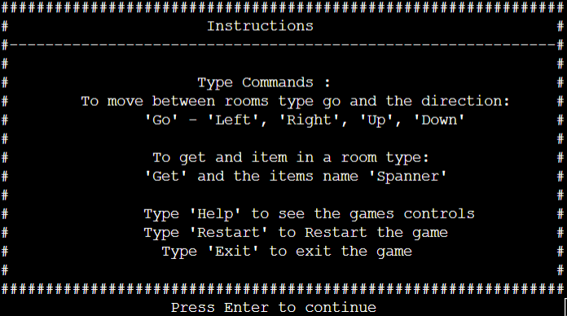

# Escape from the ISS Ravana
Escape from the ISS Ravana is a terminal text-based horror survival game where you wake up from an intergalactic slumber to find your crew mates all dead around you.  
The aim of the game is to explore the ship to discover what has killed your crew. Along the way, the player will need collect items to be able to escape and defeat the mysterious intruder. 
The game has been built to test the players short term memory whilst telling a story along the way. 
Click <a href="https://escape-from-the-iss-ravana.herokuapp.com/" target="_blank">here</a> to play the game. 

# User Experience
## Home Screen
When the user first comes to the game they will be presented with a welcome screen. 
The welcome screen gives the user a brief introduction on the game and how the user is able to complete the game. 
Within the welcome screen the user is given instructions on how to play the game by providing a list of the commands they can use in game. 
Once the user is ready to play, the screen prompts the user to press enter to play.

 

## Intro story 
After the user has hit enter on the previous screen, they will be brought to the prologue of the game. 
Here the user is given a story before they enter into the game.  
For the user to continue, they must hit enter.

## AI introduction
Once the user arrives at this screen, the ships AI will introduce itself and ask for the users name. 
Giving the user the ability to choose their name makes the game more interactive and personal. 
Once the user has entered their name, they will be taken to the next screen. 

## Game Screen
Now the user has arrived at the game screen they will be able to see their hud. 
In the hud it tells the user what deck they are on, it will show them their backpack which will be empty and will ask the user to enter their next move. 

## User controls - The user is able to control the game by entering certain commands: 

## Move
If the user wants to move between rooms they need to type "go" followed by a direction which is either left, right, up, or down, and then hit enter. 
Within the hud this will inform the user which direction they have gone, whilst changing the name of the room to reflect the room the user has moved to.

If the user is unable to go that direction there will be a message telling them they cant go that way.

## Get Item
When the user sees an item they will have to type "get" followed by the items name, which will then be added to the backpack. 
The hud will inform the user that they have picked the item up and the user will be able to see the item in the backpack.

See item: 

Get item: 

If the user enters an item that is not in the room or if the room is empty the user will get a prompt telling them that the item doesnt exisist. 

If the user enters an item they already have it will prompt them saying they already have the armour: 

## Restart
If the user types in "Restart" the game will restart which will reset everything bar the users name: 
### Enter Restart

### Middle 

### End

## Help
When the user enters in "Help" they will be presented with a list of directions on how to play the game: 

## Exit
When the user wants to exit the game before finishing they need to type in exit which will stop the game and will present this message: 

## Alien interaction
### Beat
When the user comes into contact with an intruder, the user will have to have collected a certain number of items to be able to defeat the intruders.  
There are three intruders in the game, each requiring different amount of items to defeat them as they increase in difficulty as the game goes on.  
If the user has the required amount of items, the screen will inform the user that they have defeated the intruder and also if there is an item in the room. 

### Lose
If the user does not have the correct amount of items, the game will end and the user will be informed that they have lost the game.  
Within this screen it will also give the user a hint at how many items they need to defeat the intruder. 

## Completing the game
Once the user has defeated all three intruders the user needs to make their way to the escape pod to be able to complete the game. 
When the user arrives at the escape pod and has all the correct items they will be presented with this message:
 

If the user hasn't got enough items they will be presented with this message:
  

# Flow Charts

## Map:

## Game function:

# User Experience Feedback

## Shannon White - 30/04/2023
The overall game experience was very positive. The game provides plenty of challenges to overcome while you work your way around the ship. The game has an extra dimension of having to remember the route you take, so it is highly recommended that you make a note of the places you've been so you can create the map as you play the game. The game is logical and easy to follow, and with the added objective of defeating the boss to obtain the pin before being able to escape the ship, it is complex yet enjoyable. The instructions are easy to follow and there are no unexpected screens that appear when they shouldn't.

# Testing

## CI Python Linter

I have tested my code through the CI Python Linter provided which passed with no errors found.

## Home Screen 

* Is the user able to access the Intro Story by only hitting enter? 
    * Yes, I have tested this by hitting enter which takes the user to the Intro Story.
    * I have been able to test this by pressing other keys which don't take the user to the next screen.

* Once Enter has been hit does the user see the correct screen load? 
    * Yes, it loads the correct screen for the user.

*  Are the instructions & controls easy to read and take in for the user? 
    *  Yes, the intructions & controls are easy to read and understand.

## Intro Story

* Is the user able to access the AI Introduction by only hitting enter? 
    * Yes, I have tested this by hitting enter which takes the user to the AI Introduction.
    * I have been able to test this by pressing other keys which don't take the user to the next screen.

* Once Enter has been hit does the user see the correct screen load? 
    * Yes, it loads the correct screen for the user.

## AI Introduction

* Is the user able to access the Game Screen once a name has been entered? 
    * Yes, I have tested this by entering a name and then hitting enter which takes the user to the Game Screen.

* Is the user able to enter the Game Screen without entering a name? 
    * Yes, the user is able to do this.
    * I have tested this by hitting enter before entering a name.

* Once Enter has been hit does the user see the correct screen load? 
    * Yes, it loads the correct screen for the user.

* Is the user able to create a username-style name e.g with numbers and symbols?
    * Yes, I have been able to test this by adding numbers and symbols to the name and hitting enter.

## Game 

### Movement

* Is the user able to move between rooms? 
    * Yes, the user is able to move between rooms.
    * I have tested this by entering go and the direction of choice.

* Does the hud tell the user which room they are in? 
    * Yes, the user is able to see which room they are in.
    * I have tested this by changing rooms which changes the room in the hud.

* Is the user able to use an incorrect movement? 
    * No, they are unable to use the incorrect movements, which causes no effect to the game. 
    * I have tested this by entering incorrect commands.

* If the user can't move in the direction inputted, does the game inform them of an incorrect movement?
    * Yes, the user is informed that they can't go that way. 
    * I have tested this by entering a direction that leads to a wall.

* If the user defeats an intruder are they able to move about the ship?
    * Yes, the user is able to move out of that room.
    * I have tested this by defeating an intruder and moving out of the room.

### Pick up item

* Is the user able to pick up items? 
    * Yes, the user is able to pick up items.
    * I have tested this by entering get (item_name) 

* Does the hud tell the user when they have picked up the item? 
    * Yes, the user is able to see which item they have picked up.
    * I have tested this by picking up the item and observing the hud informing me that I have picked the item up.

* Is the user able to pick up an incorrect item? 
    * No, they are unable to pick up an incorrect item. 
    * I have tested this by entering incorrect items and observing the hud informing me that the item doesn't exist.

* Does the item get added to the backpack once picked up?
    * Yes, the user is able to see the item get added to the backpack. 
    * I have tested this by entering get (item_name) and seeing it get added to backpack.

* Does the backpack show in the intruder screens? 
    * Yes, the user is still able to see the backpack in the intruder screen.
    * I have tested this by entering the intruder scene and observing the presence of the backpack.

* Is the user able to pick up an item after defeating an intruder?
    Yes, the user is able to enter get (item_name) which appends the item to the backpack.

### Restart

* Is the user able to enter restart and the game restarts? 
    * Yes, the user is able restart the game. 
    * I have tested this by entering restart and seeing the game restart.

* Does the restart function keep the username?
    * Yes, the user is able to keep their name after restart has been called.
    * I have tested this by enter restart and see the name entered still in the hud.

* Does the position of the player reset? 
    * Yes, the players position resets.
    * I have tested this by restarting the game and starting back at the Cryo Deck.

* Do the contents of the backpack reset? 
    * Yes, the user starts with an empty backpack when the function is called.
    * I have tested this by having items in the backpack, entering restart and getting back to the hud with no items.

* Does the console clear after restart has been entered? 
    * Yes the user sees the intro screen again, once the user is in the game there are no previous commands left.
    * I have tested this by restarting the game after playing.

### Exit

* Is the user able to stop the game after entering the exit command?
    * Yes, the user is able to stop the game.
    * I have tested this by entering exit.

* Does the exit message show? 
    * Yes, the user is able to see the exit message on exit.
    * I have tested this by entering exit.

### Help

* Is the user able to see the instructions when help is entered? 
    * Yes, the user is able to see the help menu.
    * I have tested this by entering help.

* Is the menu clear and easy to read? 
    * Yes, the user is able to read the instructions clearly.
    * I have tested this by entering help.

* Is the hud visable below the menu? 
    * Yes, the user is able to see the hud below the menu.
    * I have tested this by entering help. 

* Does the help menu clear after entering next move ? 
    * Yes, the menu clears after an input is entered.
    * I have tested this by entering a movement and seeing the menu clear.

### Intruder Interaction

* Does the correct message show depending on the items in the users backpack?
    * The user is able to see the correct screen dependent on items in backpack.
    * I have tested this by having the correct items in the backpack and seeing the defeat the intruder screen.
    * I have tested this by having the incorrect items in the backpack and seeing the game over screen. 

* Does the game end when you are defeated by an intruder. 
    * The users game ends when they are defeated and are unable to carry on.
    * I have tested this by being defeated by the intruder and seeing the game over message.

* Does the hint show the correct number of items needed to defeat the intruders on game over?
    * Yes, the users is presented with the correct number. 
    * I have tested this by being defeated by the intruder and seeing the game over message displaying the hint.

### Escape Pod 

* Is the user able to escape and complete the game after collecting all items?
    * Yes, the user is able to complete the game.
    * I have tested this by collecting all items and going to the escape pod. 

* Does the correct message show depending on the items in the users backpack?
    * The user is able to see the correct screen dependent on items in the backpack.
    * I have tested this by having the correct items in the backpack and seeing the complete game screen.
    * I have tested this by having the incorrect items in the backpack and the game informing me to find the code.

* Is the user able to move out of the escape pod when they have the incorrect number of items ? 
    * Yes, the user is able to move out of the escape pod and carry the game on.
    * I have tested this by entering the escape pod with the incorrcect number and was able to move out of the area.

# Deployment 

 * Escape from the ISS Ravana was deployed using Heroku:
 * Create a new app.
 * Go to settings.
 * Create config var add PORT to key and Value 8000 
 * Add buildpack - Python - nodeJS.
 * Go to deploy and connect github.
 * Search github repository - connect. 
 * Setup automatic deploy.
 
 The live link to Escape from the ISS Ravana can be found at: 
 https://escape-from-the-iss-ravana.herokuapp.com/ 
 

 # Technologies Used 

* <a href="https://www.python.org/" target="_blank">Python</a>
* <a href="https://www.gitpod.io/" target="_blank">Gitpod</a>
* <a href="https://github.com/" target="_blank">GitHub</a>
* <a href="https://git-scm.com/" target="_blank">Git</a>
* <a href="https://www.heroku.com/" target="_blank">Heroku</a>

# Credits

### Tutorials
* Bauber Youtube - <a href="https://www.youtube.com/watch?v=ERLT1iU0DVY&list=PL1-slM0ZOosXf2oQYZpTRAoeuo0TPiGpm&index=4&ab_channel=Baober" target="_blank">Video 1 - Libaries, </a> 
<a href="https://www.youtube.com/watch?v=_n0_vndSuYM&list=PL1-slM0ZOosXf2oQYZpTRAoeuo0TPiGpm&index=5&ab_channel=Baober" target="_blank">  Video 2 - Interactivity</a>

 * Corey Schafer Youtube - <a href="https://www.youtube.com/watch?v=daefaLgNkw0&ab_channel=CoreySchafer" target="_blank">Itterating Through Libaries</a>

* Dante Lee Youtube - <a href="https://www.youtube.com/watch?v=lI6S2-icPHE&t=392s&ab_channel=DanteLee" target="_blank">Here</a>

