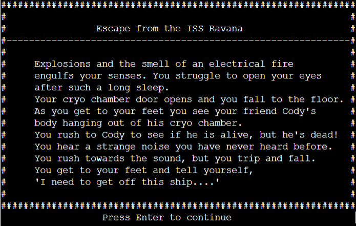

# Escape from the ISS Ravana
Escape from the ISS Ravana is a terminal text based horror survival game where you wake up from an intergalactic slumber to find your crew mates all dead around you.  
The aim of the game is to explore the ship to discover what has killed your crew, along the way the player will need collect items to be able to escape and defeat the mysterious intruder. 
The game has been built to test the players short term memory whilst telling a story along the way. 
Click <a href="https://escape-from-the-iss-ravana.herokuapp.com/" target=" _blank">here</a> to play the game. 

# User Experience
## Home Page
When the user first comes to the game the will be presented with a welcome screen. 
The welcome screen gives the user a brief intrudction about the game and how the user is able to complete the game. 
Within the welcome screen as well it gives the user the instructions on how to play the game by giving the user a list of the commands they can use in game. 
Once the user is ready to play the screen tells the user to press enter to play.

 

## Intro story 
After the user has hit enter on the previous screen they will be bought to the prologue of the game. 
Here this gives the user a story before they enter into the game.  
For the user to continue on the must hit enter.

