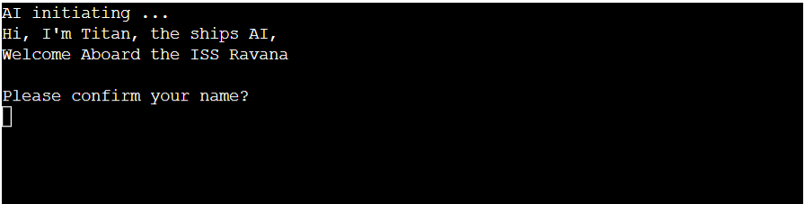

# Escape from the ISS Ravana
Escape from the ISS Ravana is a terminal text based horror survival game where you wake up from an intergalactic slumber to find your crew mates all dead around you.  
The aim of the game is to explore the ship to discover what has killed your crew, along the way the player will need collect items to be able to escape and defeat the mysterious intruder. 
The game has been built to test the players short term memory whilst telling a story along the way. 
Click <a href="https://escape-from-the-iss-ravana.herokuapp.com/" target=" _blank">here</a> to play the game. 

# User Experience
## Home Page
When the user first comes to the game the will be presented with a welcome screen. 
The welcome screen gives the user a brief intrudction about the game and how the user is able to complete the game. 
Within the welcome screen as well it gives the user the instructions on how to play the game by giving the user a list of the commands they can use in game. 
Once the user is ready to play the screen tells the user to press enter to play.

 

## Intro story 
After the user has hit enter on the previous screen they will be bought to the prologue of the game. 
Here this gives the user a story before they enter into the game.  
For the user to continue on the must hit enter.

## AI introduction
Once the user arrives at this screen the ships AI will introduce itself and ask for the users name. 
Giving the user the ability to choose their name makes the game more interactive. 
Once the user as entered their name they will be taken to the next screen. 

## Game Screen
Now the user has arrived at the game screen they will be able to their hud. 
In the hud it tells the user what deck they are on, it will show them their backpack which will be empty and will aske the user to enter their next move. 

## User controls:
The user is able to control the game by entering certain commands.  
If the user wants to move between rooms they need to type go and a direction which is either left, right, up, down and hit enter. 
Within the hud this will inform the user which direction they have gone whilst changing the name of the room to reflect the room the user has moved to.

When the user sees an item they will have to type get and the items name which will then be added to the backpack. 
The hud will inform the user that they have picked the item up and the user will be able to see the item in the backpack.

See item: 

Get item: 

## Alien interaction
### Beat
When the user comes in contact with an intruder the user will have to have collected a certain number of items to be able to defeat the intruders.  
There are 3 intruders in the game each varying a different amount of items to defeat them.  
If the user has the correct amount the screen will inform the user on how the defeated the intruder and also if their is an item in the room. 

### Loose
If the user does not have the correct amount of items the game will end and the user will be told.  
Within this screen it will also give the user a hint at how many items they need to defeat the intruder. 

